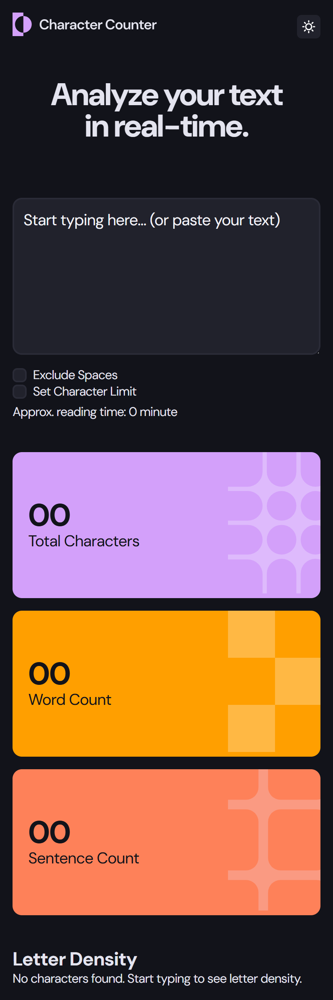
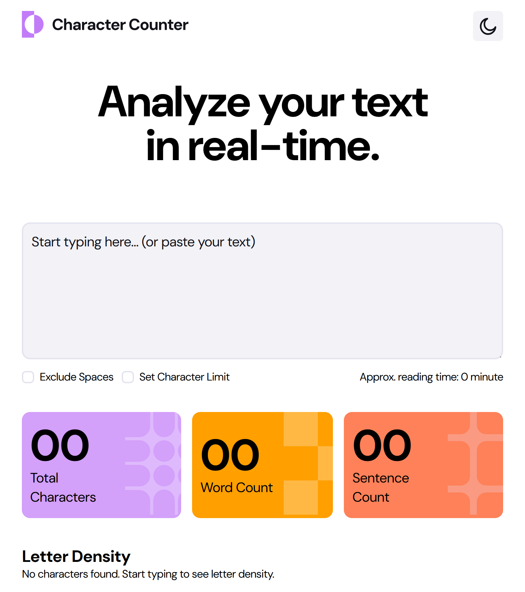
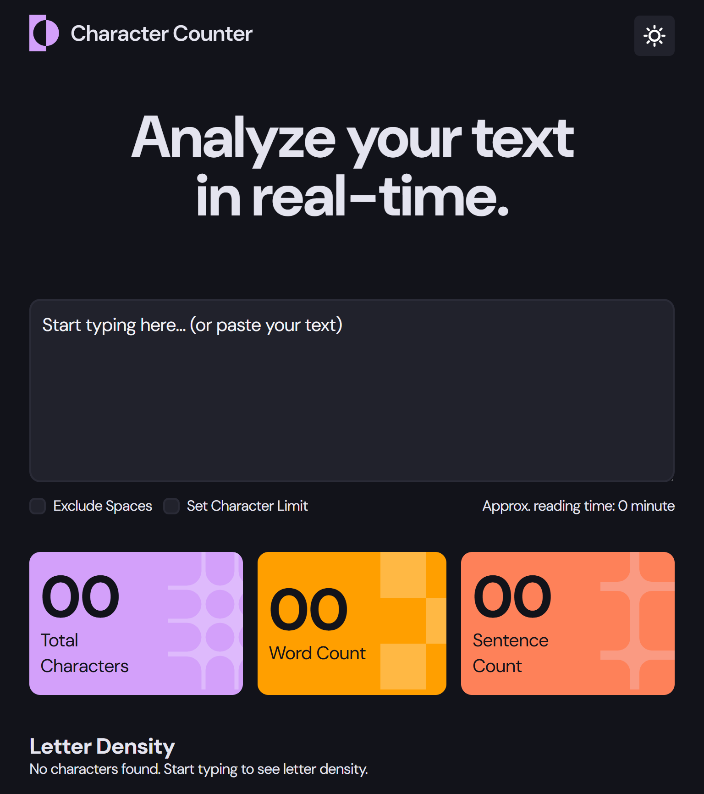
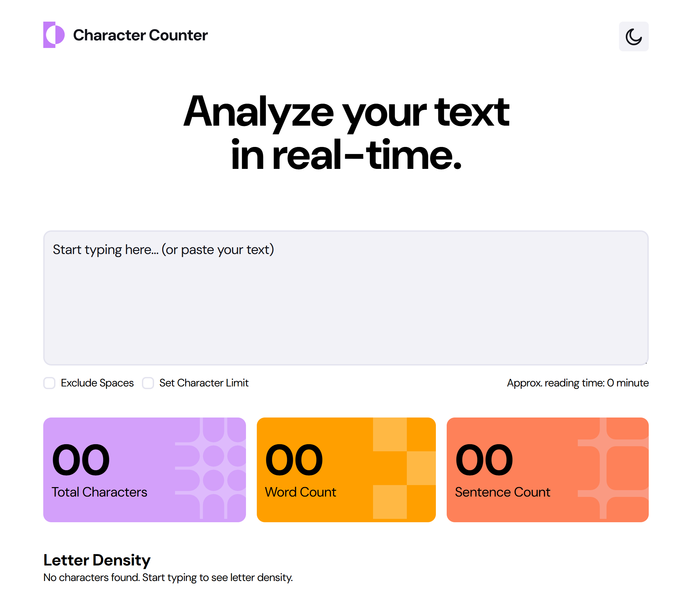
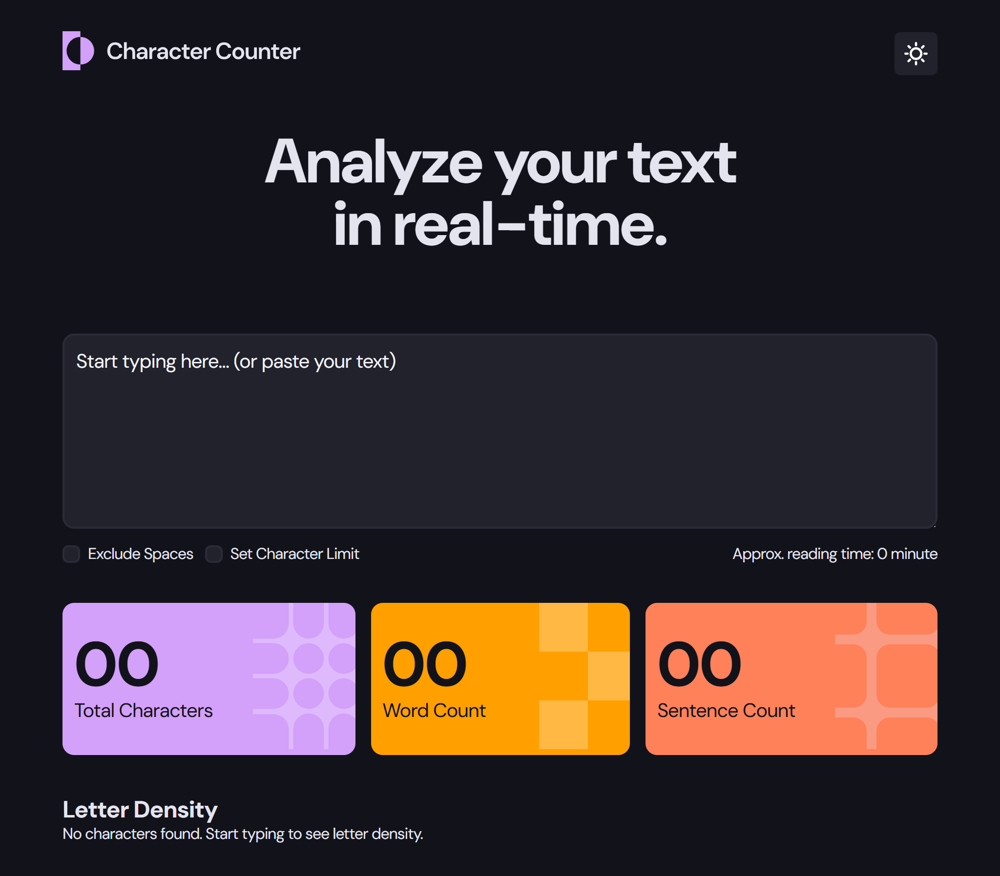

# Frontend Mentor - Character counter solution

This is a solution to the [Character counter challenge on Frontend Mentor](https://www.frontendmentor.io/challenges/character-counter-znSgeWs_i6). Frontend Mentor challenges help you improve your coding skills by building realistic projects. 

## Table of contents

- [Frontend Mentor - Character counter solution](#frontend-mentor---character-counter-solution)
  - [Table of contents](#table-of-contents)
  - [Overview](#overview)
    - [The challenge](#the-challenge)
    - [Screenshot](#screenshot)
    - [Links](#links)
  - [My process](#my-process)
    - [Built with](#built-with)
    - [What I learned \& key changes](#what-i-learned--key-changes)
    - [Continued development](#continued-development)
    - [Useful resources](#useful-resources)
  - [Highlights from my solution](#highlights-from-my-solution)
    - [How to test locally](#how-to-test-locally)
    - [Notes and next steps](#notes-and-next-steps)
  - [Author](#author)

## Overview

### The challenge

Users should be able to:

- Analyze the character, word, and sentence counts for their text
- Exclude/Include spaces in their character count
- Set a character limit
- Receive a warning message if their text exceeds their character limit
- See the approximate reading time of their text
- Analyze the letter density of their text
- Select their color theme
- View the optimal layout for the interface depending on their device's screen size
- See hover and focus states for all interactive elements on the page

### Screenshot

 

#### Mobile Light & Dark Mode

 

#### Tablet Light & Dark Mode

 

#### Desktop Light & Dark Mode

### Links

- Solution URL: [Github Repository Link](https://github.com/mmanueljoe/character_counter.git)
- Live Site URL: [Live site](https://character-counter-tau-bay.vercel.app/)

## My process

### Built with

- Semantic HTML5 markup
- CSS custom properties (custom properties used as a central theme system)
- Flexbox
- Mobile-first, responsive layout
- Vanilla JavaScript (no framework)
- Google Fonts

### What I learned & key changes

### Continued development

### Useful resources

## Highlights from my solution

- Implemented an accessible theme toggle (light ↔ dark) driven by the header icon. Clicking the icon swaps the icon (moon ↔ sun) and the project's logos to match the active theme.
- Theme preference is persisted in localStorage so the user's choice is preserved when they come back.
- Theme switching is implemented using CSS custom properties and a `data-theme` attribute on the document (`html[data-theme="dark"]`), making it easy to extend and maintain.

- Implemented accessible custom checkboxes that use the tick icon (`assets/images/icon-check.svg`) and theme-aware background colors.

### How to test locally

1. From the `starter-code` directory run using Live Server (install the live server extension):

2. Click the theme icon in the header — the icon, logo, and colors should switch immediately. Refresh the page and your selection should persist.

### Notes and next steps

- The theme system uses a `data-theme` attribute, so it's simple to style additional components or add transitions/animations later.
- Continued improvements could include theme transition animations, and making all small UI elements more theme-aware.

## Author

- Github - [Emmanuel Joe Letsu](https://github.com/mmanueljoe)
- Twitter - [@mmanueljoe](https://www.twitter.com/mmanueljoe)
